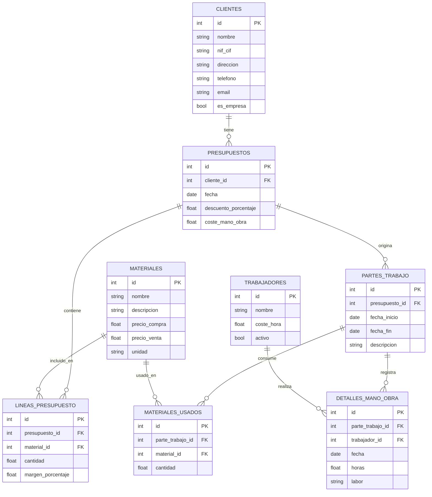

<div align="center">


### Sistema Integral de Gestión para Empresas Constructoras

[](https://www.python.org/)
[](https://www.riverbankcomputing.com/software/pyqt/)
[](https://www.sqlite.org/)
[]()
[]()

🏗️

*Aplicación de escritorio profesional para la gestión completa de presupuestos, partes de trabajo, inventario y facturación de empresas constructoras.*

[Características](#-características-principales) •
[Tecnologías](#-tecnologías-utilizadas) •
[Instalación](#-instalación) •
[Uso](#-uso) •
[Arquitectura](#-arquitectura)

</div>

---

## 📋 Descripción General

**Gestor de Presupuestos** es una solución de software completa diseñada específicamente para empresas constructoras que necesitan:

- ✅ **Gestionar clientes** con validaciones profesionales (NIF/CIF, email, teléfono)
- ✅ **Controlar inventario de materiales** con precios de compra/venta y márgenes automáticos
- ✅ **Administrar personal** con seguimiento de costes por hora
- ✅ **Crear presupuestos profesionales** con cálculos automáticos y exportación a PDF
- ✅ **Registrar partes de trabajo** con control de horas y materiales consumidos
- ✅ **Visualizar documentos en tiempo real** con sistema WYSIWYG integrado

La aplicación está **100% completa y lista para producción**, con una interfaz moderna, intuitiva y optimizada para el flujo de trabajo diario de empresas constructoras.

---

## 🎯 Características Principales

### 📊 Gestión de Datos Maestros

<table>
<tr>
<td width="33%">

#### 👥 Clientes
- CRUD completo
- Validación NIF/CIF español
- Validación email y teléfono
- Búsqueda rápida
- Soporte particulares y empresas

</td>
<td width="33%">

#### 🔨 Materiales
- Control de inventario
- Precio compra/venta
- Cálculo automático de márgenes
- Categorización
- Búsqueda avanzada

</td>
<td width="33%">

#### 👷 Trabajadores
- Gestión de personal
- Coste por hora
- Estado activo/inactivo
- Especialidades
- Control de disponibilidad

</td>
</tr>
</table>

### 💼 Gestión de Presupuestos

<details>
<summary><b>🔍 Ver características detalladas de presupuestos</b></summary>

- 📝 **Creación y edición** de presupuestos profesionales
- ➕ **Líneas de materiales** con cantidades y precios
- 💰 **Margen de ganancia** personalizable por línea
- 🧮 **Cálculo automático** de costes, ganancias y totales
- 🎁 **Descuento global** configurable
- 👤 **Asociación a clientes** con datos completos
- ⚡ **Creación rápida** de clientes y materiales desde el formulario
- 👁️ **Visor WYSIWYG** con renderizado HTML en tiempo real
- ✏️ **Edición en vivo** del documento
- 📄 **Exportación directa a PDF** profesional
- 🎨 **Plantillas personalizables** (completa y simplificada)
- 🖨️ **Impresión directa** desde la aplicación

</details>

### 📋 Gestión de Partes de Trabajo

<details>
<summary><b>🔍 Ver características detalladas de partes de trabajo</b></summary>

- 📅 **Registro de trabajos** realizados por fecha
- ⏱️ **Control de horas** trabajadas por empleado y día
- 📊 **Descripción de labores** realizadas
- 🔨 **Registro de materiales** consumidos
- 🔗 **Asociación opcional** a presupuestos
- 📈 **Cálculo automático** de costes totales
- 👁️ **Visor WYSIWYG** integrado
- ✏️ **Edición de documentos** en vivo
- 📄 **Exportación a PDF** profesional
- 💵 **Control de costes** reales vs. presupuestados

</details>

### 🎨 Sistema de Visualización WYSIWYG

- 🌐 **Motor de renderizado HTML** con QWebEngineView
- 🔄 **Vista previa en tiempo real** del documento final
- ✏️ **Modo de edición activable** con un clic
- 🔍 **Zoom in/out** para mejor visualización
- 💾 **Guardado automático** de cambios en base de datos
- 🖨️ **Impresión nativa** del sistema
- 📤 **Exportación a PDF** con un solo clic
- 🎯 **Interfaz intuitiva** con toolbar de herramientas

---

## 🚀 Tecnologías Utilizadas

<table>
<tr>
<td align="center" width="25%">
<br>
<b>Python 3.8+</b><br>
Lenguaje principal
</td>
<td align="center" width="25%">
<br>
<b>PyQt6 6.7.0+</b><br>
Interfaz gráfica nativa
</td>
<td align="center" width="25%">
<br>
<b>SQLite</b><br>
Base de datos embebida
</td>
<td align="center" width="25%">
<br>
<b>ReportLab</b><br>
Generación de PDF
</td>
</tr>
</table>

### 📚 Stack Tecnológico Completo

| Categoría | Tecnología | Versión | Propósito |
|-----------|-----------|---------|-----------|
| **Backend** | Python | 3.8+ | Lenguaje principal |
| **UI Framework** | PyQt6 | 6.7.0+ | Interfaz gráfica nativa multiplataforma |
| **Web Engine** | PyQt6-WebEngine | 6.7.0+ | Renderizado WYSIWYG de documentos |
| **ORM** | SQLAlchemy | 2.0.25 | Mapeo objeto-relacional |
| **Base de Datos** | SQLite | 3.x | Almacenamiento embebido |
| **Plantillas** | Jinja2 | 3.1.2 | Motor de templates HTML |
| **PDF** | ReportLab | 4.0.9 | Generación de documentos PDF |
| **Imágenes** | Pillow | 10.2.0 | Procesamiento de imágenes |

### 🏗️ Patrones de Diseño

- **MVC** (Model-View-Controller): Separación de responsabilidades
- **DAO** (Data Access Object): Capa de abstracción de datos
- **Template Method**: Motor de plantillas Jinja2
- **Observer**: Sistema de señales Qt para comunicación entre componentes
- **Factory**: Creación de objetos de base de datos

---

## 📦 Instalación

### Requisitos Previos

- **Sistema Operativo**: Windows 10/11, Linux, macOS
- **Python**: 3.8 o superior
- **Memoria RAM**: Mínimo 2 GB (4 GB recomendado)
- **Espacio en disco**: 100 MB (más espacio para base de datos)

### Pasos de Instalación

1. **Clonar el repositorio**
```bash
git clone https://github.com/lopezmIsmael/Gestor-de-Presupuestos.git
cd Gestor-de-Presupuestos
```

2. **Crear entorno virtual** (recomendado)
```bash
python -m venv myenv
```

3. **Activar el entorno virtual**

**Windows:**
```bash
myenv\Scripts\activate
```

**Linux/macOS:**
```bash
source myenv/bin/activate
```

4. **Instalar dependencias**
```bash
pip install -r requirements.txt
```

### 📋 Dependencias Principales

```txt
PyQt6==6.7.0
PyQt6-WebEngine==6.7.0
SQLAlchemy==2.0.25
Jinja2==3.1.2
reportlab==4.0.9
Pillow==10.2.0
```

---

## 🎮 Uso

### Ejecución de la Aplicación

```bash
python main.py
```

### 🏁 Primera Ejecución

Al ejecutar la aplicación por primera vez:
1. Se crea automáticamente la base de datos `constructora.db`
2. Se inicializan todas las tablas necesarias
3. La aplicación está lista para usar

### 📖 Flujo de Trabajo Recomendado

#### 1️⃣ Configuración Inicial

```
📁 Pestaña "Clientes"
   └── Añadir clientes (particulares o empresas)

📁 Pestaña "Materiales"
   └── Crear catálogo de materiales con precios

📁 Pestaña "Trabajadores"
   └── Registrar personal con costes/hora
```

#### 2️⃣ Crear Presupuestos

```
📁 Pestaña "Presupuestos"
   ├── Click en "Nuevo Presupuesto"
   ├── Seleccionar cliente (o crear nuevo con botón "+")
   ├── Añadir líneas de materiales
   │   ├── Seleccionar material (o crear nuevo con "+")
   │   ├── Especificar cantidad
   │   └── Ajustar margen de ganancia
   ├── Configurar descuento global (opcional)
   ├── Ver vista previa WYSIWYG
   └── Exportar a PDF o imprimir
```

#### 3️⃣ Registrar Partes de Trabajo

```
📁 Pestaña "Partes de Trabajo"
   ├── Click en "Nuevo Parte de Trabajo"
   ├── Asociar a presupuesto (opcional)
   ├── Añadir detalles de mano de obra
   │   ├── Seleccionar trabajador
   │   ├── Fecha del trabajo
   │   ├── Horas trabajadas
   │   └── Descripción de labor
   ├── Registrar materiales usados
   ├── Ver cálculo automático de costes
   └── Exportar a PDF
```

### ⌨️ Atajos de Teclado

| Atajo | Acción |
|-------|--------|
| `Ctrl+P` | Nuevo Presupuesto |
| `Ctrl+T` | Nuevo Parte de Trabajo |
| `Ctrl+Q` | Salir de la aplicación |

---

## 🏗️ Arquitectura

### 📂 Estructura del Proyecto

```
Gestor-de-Presupuestos/
│
├── 📄 main.py                          # Punto de entrada de la aplicación
├── 📄 requirements.txt                 # Dependencias del proyecto
├── 📄 constructora.db                  # Base de datos SQLite (auto-generada)
├── 📄 generate_test_data.py            # Generador de datos de prueba
│
├── 📁 src/                             # Código fuente principal
│   │
│   ├── 📁 models/                      # Capa de modelos (290 líneas)
│   │   ├── __init__.py
│   │   └── models.py                   # Entidades SQLAlchemy:
│   │                                   # - Cliente, Trabajador, Material
│   │                                   # - Presupuesto, LineaPresupuesto
│   │                                   # - ParteTrabajo, DetalleManoObra
│   │                                   # - MaterialUsado
│   │
│   ├── 📁 database/                    # Capa de acceso a datos (558 líneas)
│   │   ├── __init__.py
│   │   └── database.py                 # Data Access Objects (DAOs):
│   │                                   # - Database, ClienteDAO
│   │                                   # - TrabajadorDAO, MaterialDAO
│   │                                   # - PresupuestoDAO, ParteTrabajoDAO
│   │
│   ├── 📁 ui/                          # Interfaz gráfica (4,280 líneas)
│   │   ├── __init__.py
│   │   ├── main_window.py              # Ventana principal con pestañas
│   │   ├── styles.py                   # Sistema de estilos
│   │   ├── clients_manager.py          # Gestión de clientes
│   │   ├── materials_manager.py        # Gestión de materiales
│   │   ├── workers_manager.py          # Gestión de trabajadores
│   │   ├── quotes_manager.py           # Gestión de presupuestos
│   │   ├── work_reports_manager.py     # Gestión de partes de trabajo
│   │   └── document_viewer.py          # Visor WYSIWYG
│   │
│   ├── 📁 templates/                   # Motor de plantillas HTML
│   │   ├── __init__.py
│   │   ├── template_engine.py          # Renderizador Jinja2
│   │   ├── quote_template.html         # Plantilla presupuesto completa
│   │   ├── quote_template_simple.html  # Plantilla simplificada
│   │   └── work_report_template.html   # Plantilla parte de trabajo
│   │
│   └── 📁 utils/                       # Utilidades (267 líneas)
│       ├── __init__.py
│       └── helpers.py                  # Funciones de validación,
│                                       # formato y diálogos
│
└── 📁 myenv/                           # Entorno virtual Python (no versionado)
```

### 🗄️ Esquema de Base de Datos



### 🧮 Cálculos Automáticos

#### Presupuestos

```python
# Coste de materiales
coste_materiales = Σ(cantidad × precio_compra)

# Ganancia por línea
ganancia_linea = (precio_compra × margen_porcentaje / 100) × cantidad

# Precio de venta
precio_venta_material = coste_material + ganancia

# Subtotal
subtotal = total_materiales_venta + coste_mano_obra

# Descuento
descuento = subtotal × (descuento_porcentaje / 100)

# TOTAL FINAL
total_final = subtotal - descuento
```

#### Partes de Trabajo

```python
# Coste de mano de obra
coste_mano_obra = Σ(horas × coste_hora_trabajador)

# Coste de materiales
coste_materiales = Σ(cantidad × precio_unitario)

# COSTE TOTAL
coste_total = coste_mano_obra + coste_materiales
```

---

## 🎨 Características de Diseño

### Paleta de Colores Corporativa

```css
--primary-dark:    #1e3a5f  /* Azul oscuro principal */
--primary:         #3b82f6  /* Azul primario */
--primary-light:   #dbeafe  /* Azul claro */
--accent:          #10b981  /* Verde acento */
--warning:         #f59e0b  /* Naranja advertencia */
--danger:          #ef4444  /* Rojo peligro */
--background:      #f8fafc  /* Fondo claro */
--surface:         #ffffff  /* Superficie blanca */
```

### Sistema de Estilos Moderno

- 🎯 **Diseño Material Design** adaptado a Qt
- 📱 **Interfaz responsive** optimizada para diferentes resoluciones
- 🌈 **Paleta coherente** en toda la aplicación
- ✨ **Animaciones sutiles** en botones y controles
- 🔲 **Bordes redondeados** para modernidad
- 🎨 **CSS personalizado** para todos los widgets Qt

---

## ✅ Validaciones Implementadas

| Campo | Validación | Descripción |
|-------|-----------|-------------|
| **NIF/CIF** | 🔍 Algoritmo español | Verifica formato y dígito de control |
| **Email** | 📧 Regex estándar | Formato válido de correo electrónico |
| **Teléfono** | 📱 Formato español | 9 dígitos con prefijos válidos |
| **Campos requeridos** | ⚠️ Asterisco (*) | Indicador visual de obligatoriedad |
| **Eliminaciones** | 🗑️ Confirmación | Diálogo antes de borrar registros |
| **Números** | 🔢 Solo numéricos | Precios, cantidades y costes |
| **Fechas** | 📅 Calendario | Selector visual de fechas |

---

## 🎯 Casos de Uso

### Ejemplo 1: Crear Presupuesto para Reforma de Baño

1. **Cliente**: "Juan García" (particular)
2. **Materiales**:
   - Azulejos cerámicos: 20 m² × 15€ + 25% margen = 375€
   - Sanitarios: 1 ud × 200€ + 30% margen = 260€
   - Grifería: 1 ud × 80€ + 20% margen = 96€
3. **Mano de obra**: 1,500€
4. **Descuento**: 5%
5. **Total**: 2,119.85€

### Ejemplo 2: Registrar Parte de Trabajo

1. **Proyecto**: Reforma de baño (del presupuesto anterior)
2. **Fecha**: 10-15 de noviembre de 2025
3. **Trabajadores**:
   - Fontanero: 16 horas × 25€/h = 400€
   - Alicatador: 24 horas × 22€/h = 528€
4. **Materiales consumidos**:
   - Azulejos: 20 m²
   - Sanitarios: 1 ud
   - Grifería: 1 ud
5. **Coste total real**: 1,328€ (vs. presupuesto de mano de obra: 1,500€)

---

## 🚀 Generador de Datos de Prueba

Para probar rápidamente la aplicación con datos realistas:

```bash
python generate_test_data.py
```

Esto generará automáticamente:
- ✅ **5 clientes** (particulares y empresas)
- ✅ **7 trabajadores** (diferentes especialidades)
- ✅ **42 materiales** categorizados
- ✅ **5 presupuestos completos** con líneas
- ✅ **5 partes de trabajo** con detalles

---

## 📊 Métricas del Proyecto

| Métrica | Valor |
|---------|-------|
| **Líneas de código** | ~5,500 líneas |
| **Archivos Python** | 17 archivos principales |
| **Módulos** | 8 módulos funcionales |
| **Entidades** | 8 tablas de base de datos |
| **Plantillas HTML** | 3 plantillas profesionales |
| **Funciones de utilidad** | 15+ helpers |
| **Validaciones** | 7 tipos de validación |

---

## 📦 Compilación a Ejecutable

Para distribuir la aplicación como ejecutable standalone:

### Windows

```bash
pip install pyinstaller
pyinstaller --onefile --windowed --name="Gestor-de-Presupuestos" main.py
```

El ejecutable se generará en `dist/Gestor-de-Presupuestos.exe`

### Opciones avanzadas

```bash
pyinstaller --onefile \
            --windowed \
            --name="Gestor-de-Presupuestos" \
            --icon=icon.ico \
            --add-data="src/templates;src/templates" \
            main.py
```

---

## 🔒 Seguridad y Privacidad

- 🔐 **Base de datos local**: Sin conexión a servidores externos
- 🛡️ **Validación de entrada**: Prevención de inyección SQL
- 💾 **Backups automáticos**: Recomendado configurar copias periódicas
- 🔒 **Sin telemetría**: No se envía información a terceros
- 📝 **Cumplimiento RGPD**: Almacenamiento local de datos personales

---

## 🌟 Ventajas Competitivas

| Característica | Beneficio |
|----------------|-----------|
| **100% Offline** | No requiere internet, datos siempre accesibles |
| **Cálculos automáticos** | Reduce errores humanos en presupuestos |
| **Interfaz intuitiva** | Curva de aprendizaje mínima |
| **Multiplataforma** | Funciona en Windows, Linux y macOS |
| **Sin licencias** | Base de datos embebida sin coste adicional |
| **Documentos profesionales** | PDFs con diseño corporativo |
| **Escalable** | Soporta miles de presupuestos y clientes |
| **Personalizable** | Plantillas HTML fáciles de modificar |

---

## 🛠️ Desarrollo y Mantenimiento

### Estado del Proyecto

- ✅ **Fase 1**: Base de datos y módulos maestros - ✔️ Completada
- ✅ **Fase 2**: Lógica de presupuestos - ✔️ Completada
- ✅ **Fase 3**: Editor WYSIWYG y PDF - ✔️ Completada
- ✅ **Fase 4**: Partes de trabajo - ✔️ Completada

**Estado actual**: 🟢 **PRODUCCIÓN** (v1.0.0 - 100% Funcional)

### Roadmap Futuro

- [ ] Sistema de facturación automática
- [ ] Gráficos y estadísticas de rendimiento
- [ ] Exportación a Excel
- [ ] Sincronización en la nube
- [ ] App móvil complementaria
- [ ] Multi-usuario con roles y permisos
- [ ] Integración con plataformas de pago

---

## 🤝 Contribuciones

Este es un proyecto propietario. Para consultas sobre contribuciones o licenciamiento, contactar con el autor.

---

## 📧 Contacto y Soporte

Para consultas, sugerencias o soporte:

- 📧 Email: [Ismael.Lopez6@alu.uclm.es](mailto:ismael.lopez6@alu.uclm.es)
- 🐛 Issues: [GitHub Issues](https://github.com/lopezmIsmael/Gestor-de-Presupuestos/issues)
- 💼 LinkedIn: [Ismael López](https://www.linkedin.com/in/ismael-l%C3%B3pez-mar%C3%ADn-2b5334316?utm_source=share&utm_campaign=share_via&utm_content=profile&utm_medium=android_app)

---

## 📄 Licencia

Este software es propietario y está protegido por leyes de derechos de autor.

---

## 🙏 Agradecimientos

Desarrollado con pasión usando:
- 🐍 **Python** - Por su simplicidad y poder
- 🎨 **Qt/PyQt6** - Por la excelente UI multiplataforma
- 📊 **SQLAlchemy** - Por el ORM robusto
- 📝 **Jinja2** - Por las plantillas flexibles
- 📄 **ReportLab** - Por la generación de PDF

---

<div align="center">

### ⭐ Si este proyecto te resulta útil, considera darle una estrella en GitHub

[](https://www.python.org/)
[](https://www.riverbankcomputing.com/software/pyqt/)
[](https://www.sqlite.org/)

</div>
